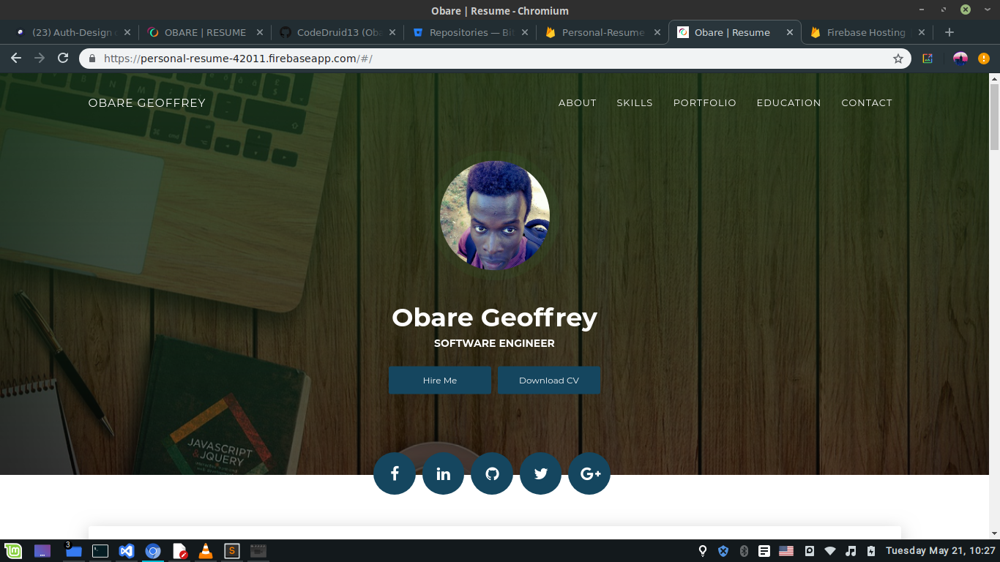

# Cool-Angular-Portfolio-Site
A portfolio site modeled with Angular and typescript

***Note: Was built on Angular 6 --> Migrate to 7 ***

- Use upgrade guide
  [Migration Guide][upgrade].
  
 - Hosted on Firebase
 [Hosting Guide][hosting].
 

 
 - Live Demo
 [Demo][website].
      

# Angular

Angular is a development platform for building mobile and desktop web applications using Typescript/JavaScript and other languages.

## Quickstart

[Get started in 5 minutes][quickstart].

[quickstart]: https://angular.io/guide/quickstart
[ng]: https://angular.io
[upgrade]: https://update.angular.io/
[hosting]: https://firebase.google.com/docs/hosting
[website]: https://personal-resume-42011.firebaseapp.com/#/

